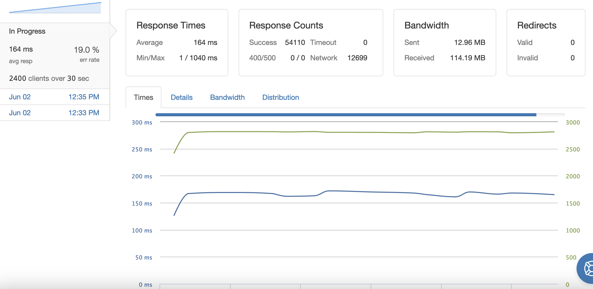

# Reviews-API
I designed and built out the back end for the website of a clothing retailer, focusing on the ratings and reviews section. This included providing routes and queries for a user to fetch reviews and product metadata, insert a new review, and interact with existing reviews. Technologies used for creating the back end include Express, PostgreSQL and Jest.

The initial implementation and optimizations of the backend led to the back end being able to support 1000 queries per second, an average latency of 5ms and an error rate of 0% where each query was fetching the reviews for a random product with an ID between 1 - 1000000. The initial optimizations included indexing frequently used columns and using Postgres to process data instead of Node whenever possible.

After changing the query used by the get request, the server was able to support a maximum of between 1200 - 1300 queries per second, though there would be an initial spike of latency up to 180ms before settling back to 5ms but still an error rate of 0%. This increase in speed was made possible by replacing an inefficient join with a subquery that minimized the data needed and better accounted for edge cases in the data.

The maximum number of queries tolerated per second by the server was increased further by deploying the server on AWS EC2 instances and using a load balancer to accommodate increased activity among multiple servers. When using just 2 servers and a load balancer, the new maximum requests per second the application could handle was 2400 queries per second and a stable average latency of 180ms.

There is still room for further optimizations to be made. The tests assumed that people were browsing random products, but if there were a homepage and initial products displayed, caching could be used to save time when users navigate to frequently looked at products.
